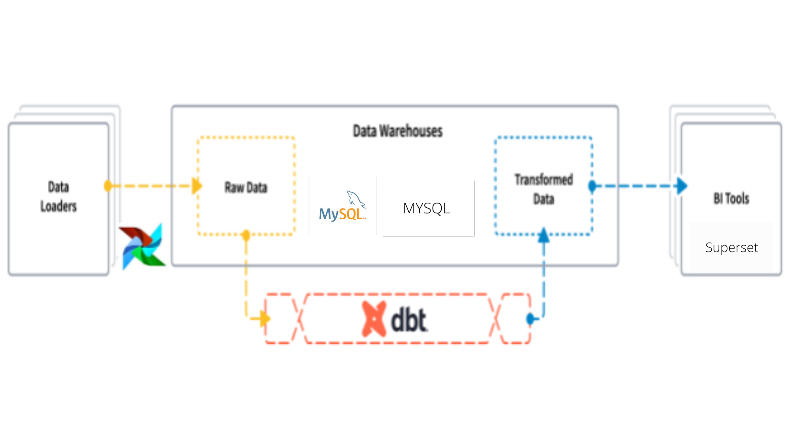

# Scalable DataWarehouse Migration to MySQL & Superset

<!-- Table of contents -->
- [Scalable DataWarehouse Migration to MySQL & Superset](#scalable-datawarehouse-migration-to-mysql--superset)
  - [About](#about)
  - [Objectives](#objectives)
  - [Data](#data)
  - [Repository overview](#repository-overview)
  - [Requirements](#requirements)
  - [Usage](#usage)
    - [Docker-compose](#docker-compose)
  - [Contrbutors](#contrbutors)
  - [Contributing](#contributing)
  - [License](#license)

## About
<!-- import an image -->


An ELT pipeline that can be used to process data from a variety of sources. The pipeline is designed to be scalable and easy to use. The pipeline is designed to be used in a variety of environments like Data Warehouse. It can be used by analytic engineers in the different department setup transformation workflows on a need basis. 

## Objectives
The objective of this project is to migrate the Datawarehouse from a PostgreSQL to a MySQL database, and the visualization tool from redash to Superset.


## Data
The [Data](https://www.kaggle.com/c/rossmann-store-sales/data) used for this project is from open source dataset called PNeuma which is an open large-scale dataset of naturalistic trajectories of half a million vehicles that have been collected by a one-of-a-kind experiment by a swarm of drones in the congested downtown area of Athens, Greece. 

## Repository overview
 Structure of the repository:
 
        ├── dags  (airflow scripts containing the dags)
        ├── .github  (github workflows for CI/CD, CML)
        ├── screenshots  (Important screenshots)
        ├── scalable_dwh_migration_dbt (dbt configrations and models)
        ├── data    (contains data)
        ├── superset  (contains superset's configuration)
        ├── scripts (contains the main script)	
        │   ├── logger.py (logger for the project)
        │   ├── plot.py (handles plots)
        │   ├── load_data.py (Data loading)
        ├── notebooks	
        │   ├── EDA.ipynb (overview of the Data)
        ├── tests 
        │   ├── test_scripts.py (test for the script)
        ├── README.md (contains the project description)
        ├── requirements.txt (contains the required packages)
        |── LICENSE (license of the project)
        ├── setup.py (contains the setup of the project)
        └── .dvc (contains the dvc configuration)

## Requirements
The project requires the following:
python3
Pip3
docker
docker-compose

## Usage
### Docker-compose
All of the project depebdecies are installed using docker-compose. The docker-compose file is located in the root directory.
Steps to setup the project:
1. create a .env file and add the required configurations
  ```

DB_HOST_DEV=<your_db_host>
DB_PORT_DEV=<your_db_port>
DB_USER_DEV=<your_db_user>
DB_PASSWORD_DEV=<your_db_password>
DB_NAME_DEV=<your_db_name>
```

2. create another environment file and add the required configurations for airflow
```
<!-- AIRflow -->
AIRFLOW_UID=<your_uid>
AIRFLOW_GID=<your_gid>
&airflow-common-env
AIRFLOW__CORE__EXECUTOR=CeleryExecutor
AIRFLOW__CORE__SQL_ALCHEMY_CONN=<db_host>:<db_port>/<db_name>
AIRFLOW__CELERY__RESULT_BACKEND=db+postgresql://<db_user>:<db_password>@<db_host>:<db_port>/<db_name>
AIRFLOW__CELERY__BROKER_URL=redis://:@redis:6379/0
AIRFLOW__CORE__FERNET_KEY=''
AIRFLOW__CORE__DAGS_ARE_PAUSED_AT_CREATION='true'
AIRFLOW__CORE__LOAD_EXAMPLES='true'
AIRFLOW__API__AUTH_BACKEND='airflow.api.auth.backend.basic_auth'
AIRFLOW__SMTP__SMTP_HOST=smtp.gmail.com
AIRFLOW__SMTP__SMTP_USER=<your_email>
AIRFLOW__SMTP__SMTP_PASSWORD=<your_password>
AIRFLOW__SMTP__SMTP_PORT=587
AIRFLOW__SMTP__SMTP_MAIL_FROM=Airflow
```
If you want to use service other than gmail, you can change the smtp host and port.

3. Run `docker-compose up airflow-init` to initialize airflow user.
4. Run `docker-compose up -d` to start the project and visit localhost:8080 in your browser to access airflow admin.
5. Run `docker exec <dbt-cli-id> /bin/bash` to execute dbt commands.
6. Run `docker-compose down` to stop the project.

## Contrbutors
- Yididiya Samuel

## Contributing
Pull requests are welcome. For major changes, please open an issue first to discuss what you would like to change.

Please make sure to update tests as appropriate.


## License
[MIT](https://choosealicense.com/licenses/mit/)
